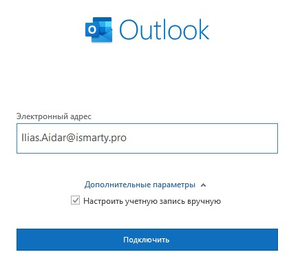
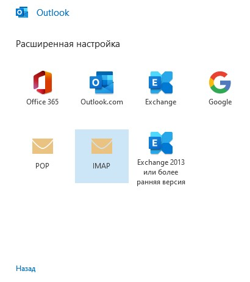
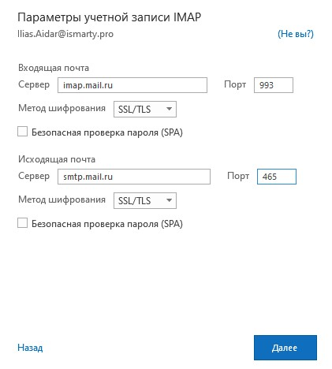
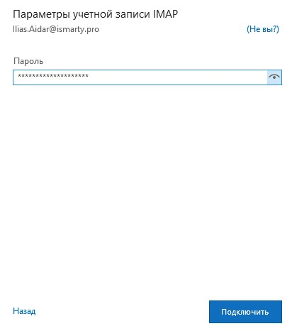

# Настройка почтового ящика на базе MAIL.RU (VK Workspace) в программе Outlook

Чтобы войти в ящик Mail.ru через Microsoft Outlook, обычный пароль от ящика не подойдёт — вам понадобится специальный пароль для внешнего приложения. Для создания такого пароля перейдите значок шестеренки → «Безопасность» → «Пароли для внешних приложений».

1.	Откройте Microsoft Outlook 2016/2019. 
2.	Если вы уже авторизованы в приложении с какой-либо почтой, то перейдите «Файл» → «Сведения» → «Добавить учётную запись». Если не авторизованы, пропустите этот шаг.
3.	Введите адрес ящика на Mail.ru в поле Электронный адрес. Выберите «Дополнительные параметры», отметьте галочку «Настроить учетную запись вручную» и нажмите «Подключить».

    

4. Выберите «IMAP».

    

5. Проверьте, правильно ли заполнены поля:

    **Входящая почта**
    | Название          | Значение          |
    |-------------------|-------------------|
    | Сервер            | imap.mail.ru      |
    | Порт              | 993               |
    | Метод шифрования  | SSL/TLS           |
    
    **Исходящая почта**
    | Название          | Значение          |
    |-------------------|-------------------|
    | Сервер            | smtp.mail.ru      |
    | Порт              | 465               |
    | Метод шифрования  | SSL/TLS           |

    

6. Нажмите «Далее».

7. Введите пароль для внешнего приложения. [Что это?](https://help.mail.ru/mail/settings/2fa/apps)
    

8. Нажмите «Подключить» → «Ок»